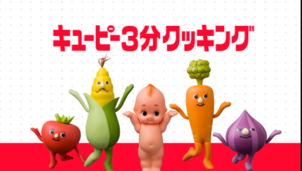

# 冴えないAIの育て方

  
  
---
  
## Project
  
- Pathways "Innovative Planning" Level 3
- 効果的な視覚資料の作成
  
- 目的
    - このプロジェクトの目標は、スピーチ中にさまざまな視覚資料を選択・使用する演習を行うことです。
- 概要
    - 視覚資料の使用が役立つスピーチトピックを選択します。1種類以上、3種類以内の視覚資料を作成してプレゼンテーションを強化します。クラブ例会で5～7分のプレゼンテーションを行います。
  
---
  
## 冴えないAIの育て方

  
  
---
  
## AIとかプログラムとか難しい？
  

  
---
  
## そんなことない！
  

  
---
  
## 作ってみよう！
  

  
---
  
## 出来上がったものがこちら
  
**Siriっぽい何か**
  
---
  
## 材料
  
- Visual Studio Code: 1つ **無料**
- Python: 1つ **無料**
- Flask: 1つ **無料**
- Google Chrome: 1つ **無料**
- りんなGPT-2モデル: 1つ **無料**
  
---
  
## 作り方
  
---
  
## AI使うのは難しくない！